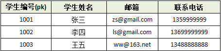
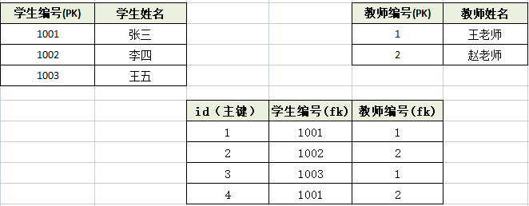
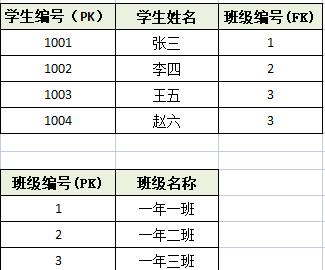

## 什么是数据库的三范式
数据库表设计的原则。教你怎么设计的数据库有效，并且节省空间。
## 三范式
1. 第一范式：任何一张表都应该有主键，每个字段是原子性的，不能再分
	1. 以下表的设计不符合第一范式：无主键，并且联系方式可拆分。
 

	3. 应该这样设计：
 

2. 第二范式：建立在第一范式的基础上，另外要求所有非主键字段**完全依赖**主键，不能产生**部分依赖**。
	1. 一下表存储学生和老师的信息
 

虽然符合第一范式，但是违背了第二范式，学生姓名、老师姓名都产生了部分依赖，导致数据冗余。
	2. 以下这种设计方式就是复合第二范式的：

3. 第三范式：建立在第二范式基础上，非主键字段不能传递依赖与主键字段。
	1. 以下设计方式都是违背第三方是的

	2. 一下这种设计是符合第三范式的：

